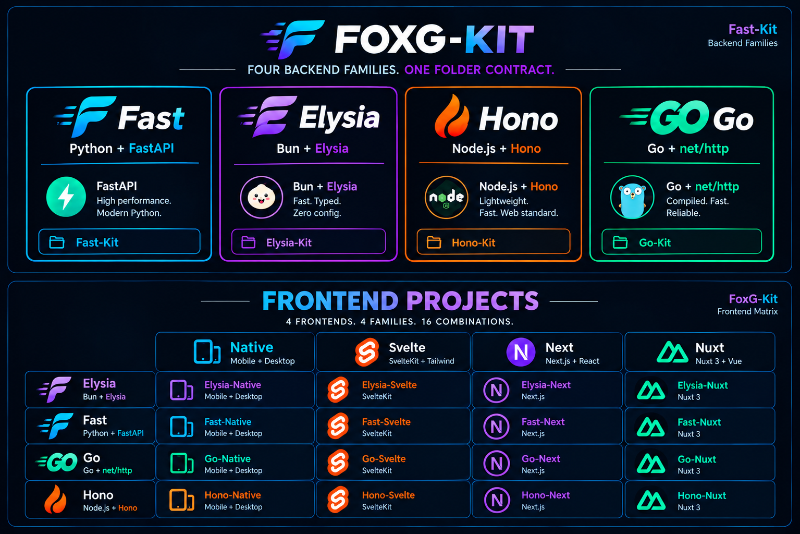

[](./FoxG-Kit.png)

# Fast-Git

Standalone CLI that turns **this machine** (laptop or Linux VM) into a **GitLab Omnibus + GitLab Runner** node, then seeds Fast-* (or any) projects with CI/CD.

Sibling to Fast-Svelte’s `__ctrl__`: same argparse + `lib/*` + `remote/*.sh` conventions.

## Quick start

### On an Ubuntu VM (in place)

```bash
chmod +x fast-git.sh remote/*.sh
./fast-git.sh setup
# optional: GITLAB_EXTERNAL_URL=http://gitlab.example.com ./fast-git.sh setup
./fast-git.sh status
```

After setup:

1. Open the printed GitLab URL; sign in as `root` (password in `/etc/gitlab/initial_root_password`).
2. Create a personal access token → save as `safe/gitlab.token` (or set `GITLAB_TOKEN`).
3. Seed projects:

```bash
./fast-git.sh project seed ../fast-template/fast-svelte --profile fast-family
./fast-git.sh project seed ../fast-template/fast-rio    --profile fast-family
```

### From a Windows laptop (remote provision)

```bat
fast-git.bat provision 192.168.1.50 --key safe\vm.pem --user ubuntu
```

### From macOS

Double-click `fast-git.command` (opens Terminal), or:

```bash
chmod +x fast-git.command fast-git.sh
./fast-git.command setup
./fast-git.command provision 192.168.1.50 --key safe/vm.pem
```

Or add the host to `servers.json` and:

```bat
fast-git.bat provision --target all
```

## Commands

| Command | What it does |
|---------|----------------|
| `setup-local` | Create/refresh `.venv` + requirements |
| `setup` | Local: base packages, Docker, UFW, GitLab Omnibus, Runner |
| `status` | Health of GitLab / Runner / Docker |
| `list` / `ping` / `connect` / `exec` | servers.json SSH helpers |
| `gitlab install\|status\|restart\|backup` | Omnibus ops |
| `runner install\|register\|status` | Runner ops |
| `project create\|seed\|list\|remove` | GitLab API + git push + CI profiles |
| `provision <host>` | Same setup over SSH (multi-target via `servers.json`) |
| `flatten` / `restore-flat` | Rewrite / adopt single-root git history (same as siblings) |
| `deploy *` | Pointers only — real deploy stays in each project’s `__ctrl__/remote` |

## Seed profiles

- **`fast-family`** — writes `.gitlab-ci.yml` that calls `__ctrl__/*-ctrl.sh test all`, `docker compose build`, and `__ctrl__/remote/start-prod.sh`
- **`python`** / **`docker`** — generic pipelines
- **`generic`** — create + push only (no CI file)

## Layout

```
fast-git/
├── fast-git.bat / fast-git.sh / fast-git.command   ← Windows / Unix / macOS Finder
├── main.py
├── servers.json
├── safe/                 # tokens, PEM keys (gitignored)
├── lib/                  # config, ssh, gitlab_api, ops, seed
├── utils/
│   ├── gitflat/          ← flatten / restore-flat
│   └── local/            ← setup-local
├── profiles/             # fast_family, python, docker, generic
└── remote/
    ├── setup-ubuntu-gitlab.sh
    ├── gitlab-status.sh
    └── gitlab-backup.sh
```

## Architecture note

GitLab runs as **Omnibus** (bundled PostgreSQL/Redis), not GitLab-in-Docker. Docker is reserved for CI job containers and the Fast-* apps you deploy. App production VMs stay managed by each project’s own `__ctrl__` — Fast-Git’s CI deploy stage triggers those scripts rather than reimplementing them.
